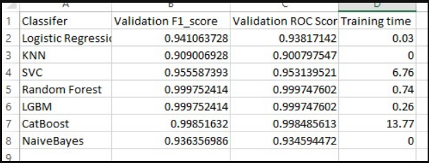

# Asteroid-Classification

## Introduction

The utilization of artificial intelligence (AI) has become crucial in addressing real-world challenges, particularly in the field of space science. The presence of numerous asteroids in the solar system, with their orbits susceptible to alteration due to collisions, poses a potential threat to Earth. Past incidents, such as the 1908 Siberian explosion and the 2013 Chelyabinsk impact, underscore the dangers associated with asteroids entering Earth's atmosphere. The complexity of analyzing thousands of data points to predict the future trajectories of hazardous asteroids exceeds human capacity. Therefore, the integration of AI algorithms is essential for effectively studying and determining the potential threat posed by asteroids, contributing to early detection and prevention strategies.


## Dataset
There are two dataset in this project. Below is the description of the data
- NeoWS &nbsp; &nbsp; &nbsp; &nbsp;  &nbsp;  &nbsp; &nbsp; : Web service by NASA JPL Asteroid team  [(Dataset Link)](https://drive.google.com/drive/folders/1NUtCdRhmBJxJY26ZFw9nW4qT8Has8Fhf?usp=sharing)
- Asteroid Data&nbsp; &nbsp; : A public Kaggle dataset by Mir Sakhawat Hossain [(Dataset Link)](https://drive.google.com/drive/folders/1oKkVucZzgh8DCsmG5-HTR7MIha6hTp7M?usp=sharing)


## How to use
1. Download the dataset that has been given on the "Dataset" section

2. Download the project and extract it to your desired folder
3. Please put the all dataset on the project in a folder called "dataset". in the "dataset" folder, for NeoWs dataset please create a folder inside the "dataset" folder called "NeoWS" and put all of the NeoWs data inside of the folder. For Asteroid Data, please create a folder inside the "dataset" folder called "Asteroids" and put all of the Asteroid data inside of the folder the image below will describe the result.


   


4. For running the project with NeoWs dataset. please run the given code below on the terminal.
```powershell
python .\run.py  -d "NEOws"
```
5. For running the project with Asteroid dataset. please run the given code below on the terminal.
```powershell
python .\run.py  -d "Asteroids"
```

6.  the given data is actually imbalanced, we put two technique on this project which are **Bootstrapping** and **SMOTE**. if you would like to SMOTE you would have to add another paramater as below :
```powershell
python .\run.py  -d "NEOws" -b "SMOTE"
```

## Result

The result of the project should create two Xslx file which first containing the machine learning model and the second should be the deep learning model. 
The given picture will describe the result.




## Contributors

| <font size=3>Name     | <font size=3>Student ID |
|-----------------|-----------------|
|<font size=3> Alvin Buana</font>   | <font size=3>112522608                                  |
| <font size=3>Josh Lee     | <font size=3>112522011                 |
| <font size=3>Thai Duy Quy    | <font size=3>111582610 |
